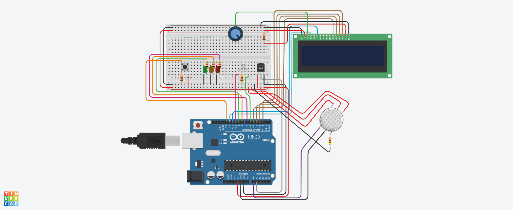

# Safe-T – Intelligent Air Quality Monitor

## 📌 Introduction

**Safe-T** is an intelligent air quality monitoring device designed to detect and respond to indoor air pollution in real-time. It tracks temperature, humidity, and harmful gas concentrations (such as CO₂ and VOCs), providing immediate visual feedback and actionable recommendations to improve the indoor environment.

This project was designed to be **accessible**, **educational**, and **easy to replicate**, particularly in home or classroom settings.

---

## ⚙️ Features

- Measures **temperature** and **humidity** using a **DHT11 sensor**
- Detects air pollution with the **MQ-135 gas sensor**
- Real-time data display on a **16x2 LCD screen**
- Visual alerts via **LEDs** (green, yellow, red)
- **Adjustable contrast** for the LCD using a **potentiometer**
- Modular and beginner-friendly **open-source code**

---

## 🛠 Required Components

| Component           | Description                              |
|---------------------|------------------------------------------|
| Arduino Uno         | Main microcontroller board               |
| DHT11               | Temperature and humidity sensor          |
| MQ-135              | Gas sensor (CO₂, VOCs, etc.)             |
| 16x2 LCD Display    | Displays air quality information         |
| Potentiometer       | Adjusts LCD screen contrast              |
| LEDs + Resistors    | Visual indicators for air quality status |
| Breadboard + Wires  | For prototyping the circuit              |

---

## 📂 Project Structure

<pre>
safe-t/
├── code/          # Arduino source code
├── images/        # Circuit diagrams and screenshots
├── docs/          # Additional documentation
├── LICENSE        # Project license
└── README.md      # This file
</pre>
